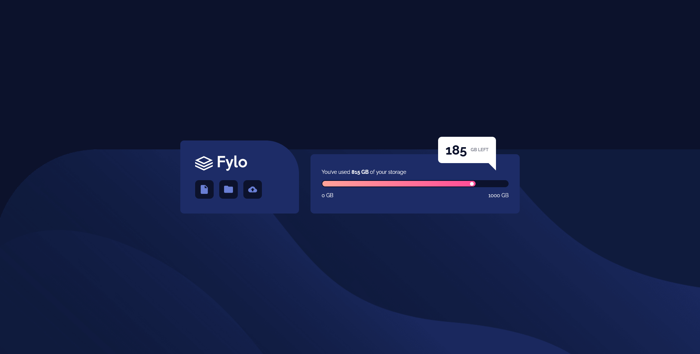

# Frontend Mentor - Fylo data storage component solution

This is a solution to the [Fylo data storage component challenge on Frontend Mentor](https://www.frontendmentor.io/challenges/fylo-data-storage-component-1dZPRbV5n). Frontend Mentor challenges help you improve your coding skills by building realistic projects. 

## Table of contents

- [Overview](#overview)
  - [The challenge](#the-challenge)
  - [Screenshot](#screenshot)
  - [Links](#links)
- [My process](#my-process)
  - [Built with](#built-with)
  - [What I learned](#what-i-learned)
  - [Continued development](#continued-development)
- [Author](#author)

## Overview

### The challenge

Users should be able to:

- View the optimal layout for the site depending on their device's screen size

### Screenshot



### Links

- Solution URL: [Add solution URL here](https://your-solution-url.com)
- Live Site URL: [Add live site URL here](https://your-live-site-url.com)

## My process

### Built with

- Semantic HTML5 markup
- CSS custom properties
- Flexbox
- CSS Grid
- Mobile-first workflow

### What I learned

With a lot of struggle, improved my knowledge about Positions, relative and absolute, after pseudo-elements and background position. Also the bottom section of the page, with the gradient progress bar, was required a lot o thought to make it work.

```html
<section class="blue-bg storage-usage">
      <p>You’ve used <span class="bold-txt">815 GB</span> of your storage</p>
      <div class="progress-container">
        <div class="container-bar">
          <div class="gradient">
            <div class="marker"></div>
          </div>
        </div>
        <div class="progress-label">
          <p>0 GB</p>
          <p>1000 GB</p>
        </div>
      </div>
    </section>
```
```css
.balon::after {

        content: "";
    
        width: 0;
        height: 0;
    
        position: absolute;
    
        border-left: 20px solid transparent;
    
        border-top: 20px solid #fff;
    
        bottom: -20px;
        left: 136.109px;
    }
```

### Continued development

I'll keep look for even more better and cleaner ways to make the balon and his triangle.

## Author

- Frontend Mentor - [@jAllanOli](https://www.frontendmentor.io/profile/jAllanOli)
